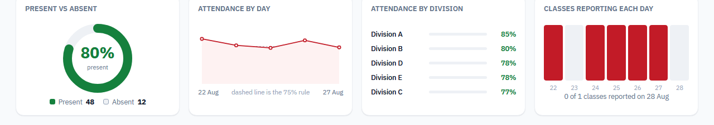

# ADYPU Academic Dashboard

Daily attendance for Ajeenkya D Y Patil University, from a Google Form to a
dashboard the leadership team can read at a glance. Nine schools, 103 classes,
drilled School to Year to Branch to Division, over any date range.

Live: <https://adypu-academic-dashboard.fast-page.org/>


*All figures in these screenshots are sample data.*

## What it does

- **One number that means something.** Present against the strength of the
  classes that actually reported, next to a count of how many of the 103
  classes those were. Neither number can mislead on its own.
- **Any date range.** Presets for the latest day, today, 7 and 30 days, or two
  native date inputs. A range averages each class over the days it reported, so
  a week stays comparable to a day, and the breakdown names the exact dates
  behind every average.
- **Drill down and everything follows.** Pick a school, year, branch or a single
  division and the summary, the breadcrumb and all four charts rescope to it.
- **Charts with no chart library.** Present against absent, attendance per day
  against the university's 75% rule, a ranked comparison of whatever sits one
  level below your selection, and how many classes filed a form each day.
- **Export as PDF.** The page prints itself as a dated report, named after the
  breadcrumb, showing only the school you drilled into.




## How the data gets here

```
Google Form  ->  response Sheet  ->  Apps Script (tools/apps-script.gs)
                                       | POST whole sheet as CSV,
                                       | secret in X-Ingest-Secret
                                       v
                                  api/ingest.php
                                       | parse + aggregate
                                       v
                                  cache/attendance.json
                                    {"days": {date: {class: present}}}
                                       ^
                       index.php ------+ read on every request
                       api/division.php
```

Google pushes to the dashboard rather than the dashboard pulling from Google,
because the host blocks outbound HTTP from PHP. The cache holds one present
count per class per day, which is what lets any date range be rebuilt from it.

Two things are deliberate and easy to get wrong:

- **`includes/structure.php` is canonical.** Every class that exists and its
  strength. Faculty submit a present count only; the denominator never comes
  from a submitted row, so it cannot drift from a typo on the Form.
- **The structure leads the submissions.** A class nobody reported still exists
  in the tree, still contributes its strength, and is marked `reported => false`,
  so "nobody came" and "nobody submitted" can never look the same.

## Stack

PHP 8 with no framework, no Composer, and no build step. Vanilla JavaScript in
plain `<script src>` tags, CSS with custom properties, inline SVG icons. Charts
are hand-drawn SVG and CSS. MySQL (`db/schema.sql`) is defined but not read
from: the app runs with no database at all.

## Running it locally

```
php -S localhost:8000                  # then open /index.php
php tests/test_attendance_parser.php   # the parser suite, prints OK
node tests/test_charts.js              # the chart scoping suite, prints OK
php tools/form-options.php             # regenerate the Form's dropdown options
php tools/data-request.php structure   # the school data request workbook
```

With no `cache/attendance.json`, the dashboard serves sample rows so the UI is
usable on a fresh checkout.

`tests/` is two assert-based scripts, no framework. Add a case for any parser
change: every bug so far has been a row silently not counting, which is exactly
what a test catches and eyeballing does not.

## Layout

```
index.php              the dashboard
api/ingest.php         receives the pushed sheet
api/division.php       division breakdown for the modal
includes/attendance.php  parsing, the day map, ranges, totals
includes/structure.php   the canonical class list
js/dashboard.js        drill-down, range controls, the modal
js/charts.js           the four charts
tools/apps-script.gs   goes in the Apps Script editor, not on the server
```
