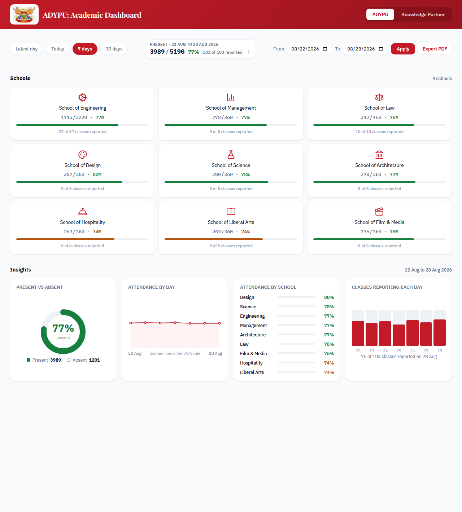
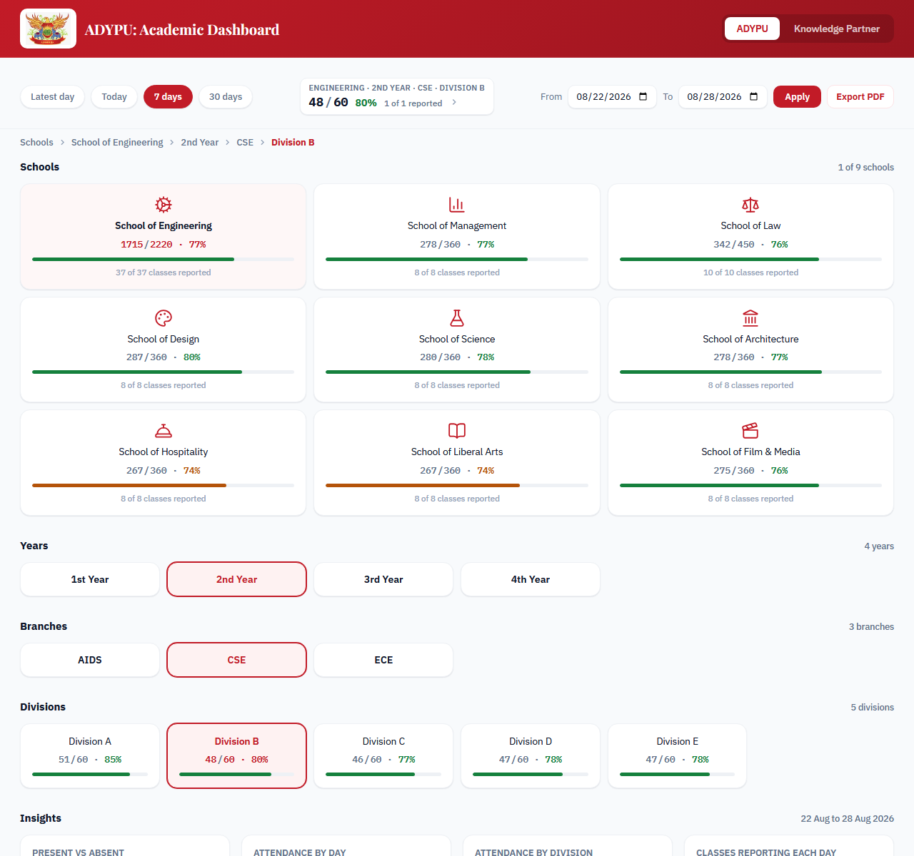
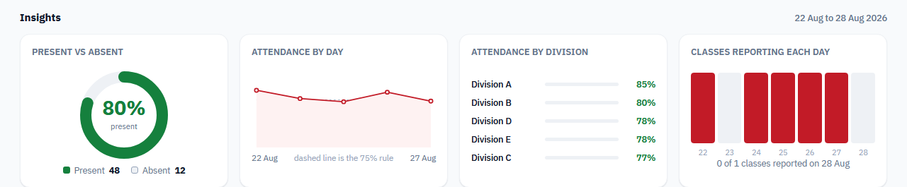

# ADYPU Academic Dashboard

Daily attendance for Ajeenkya D Y Patil University: nine schools, 136 classes,
drilled from School to Year to Branch to Division over any date range.

Live: <https://adypu-academic-dashboard.fast-page.org/>



*Figures in these screenshots are sample data.*

## What it does

- **A number that means something.** Present against the strength of the classes
  that reported, beside a count of how many of the 136 those were. Neither can
  mislead on its own.
- **Any date range.** Presets, or two date inputs. A range averages each class
  over the days it reported, so a week stays comparable to a day, and the
  breakdown names the dates behind every average.
- **Drill down and everything follows.** Pick a school, year, branch or a single
  division; the summary, breadcrumb and all four charts rescope to it.
- **Export as PDF.** The page prints itself as a dated report, named after the
  breadcrumb, showing only the school in view.



## Insights

Four charts, all hand-drawn SVG and CSS, no chart library. They rescope with the
drill-down and cover the range you picked: present against absent, attendance
per day against the university's 75% rule, a ranked comparison of whatever sits
one level below your selection, and how many classes filed a form each day. That
last one is the honesty check, since a great percentage resting on three forms
should look like exactly that.



## How the data gets here

```
Google Form  ->  response Sheet  ->  Apps Script (tools/apps-script.gs)
                                       | POST whole sheet as CSV,
                                       | secret in X-Ingest-Secret
                                       v
                                  api/ingest.php
                                       | parse + aggregate
                                       v
                                  cache/attendance.json
                                    {"days": {date: {class: present}}}
                                       ^
                       index.php ------+ read on every request
                       api/division.php
```

Faculty submit a present count on a Google Form; an Apps Script pushes the
response sheet to `api/ingest.php` on every submission. The cache holds one
count per class per day, which is what lets any date range be rebuilt from it.

Two rules hold the numbers together:

- **`includes/structure.php` is canonical.** Every class that exists and its
  strength. The denominator never comes from a submitted row, so it cannot drift
  from a typo on the Form.
- **The structure leads the submissions.** A class nobody reported still exists,
  still contributes its strength, and is flagged unreported, so "nobody came"
  and "nobody submitted" never look the same.

## Running it

PHP 8, no framework, no Composer, no build step. Vanilla JS, hand-drawn SVG
charts.

```
php -S localhost:8000                  # then open /index.php
php tests/test_attendance_parser.php   # parser suite, prints OK
node tests/test_charts.js              # chart scoping suite, prints OK
php tools/form-options.php             # regenerate the Form's dropdowns
```

With no `cache/attendance.json`, the dashboard serves sample rows, so a fresh
checkout is usable straight away. `tests/` is two assert-based scripts, no
framework; add a case for any parser change.

## Layout

```
index.php                dashboard
api/ingest.php           receives the pushed sheet
api/division.php         division breakdown for the modal
includes/attendance.php  parsing, the day map, ranges, totals
includes/structure.php   the canonical class list
js/dashboard.js          drill-down, range controls, modal
js/charts.js             the four charts
tools/apps-script.gs     goes in the Apps Script editor
```
