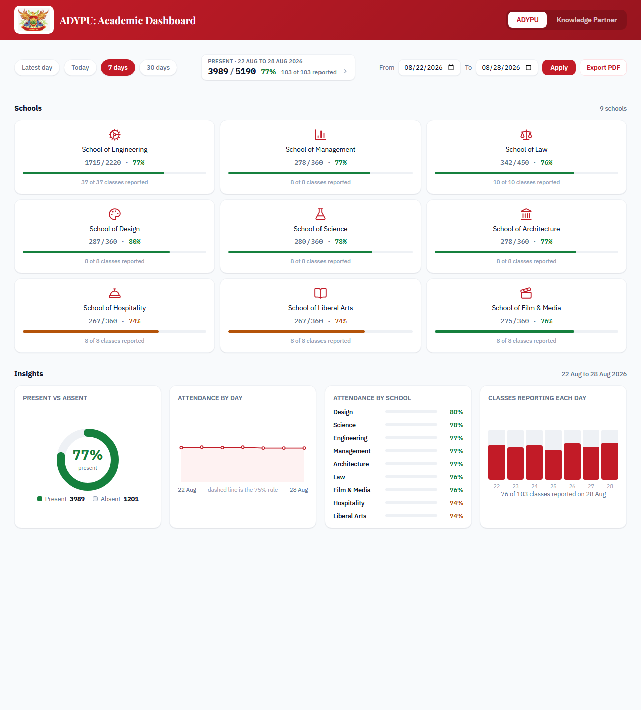
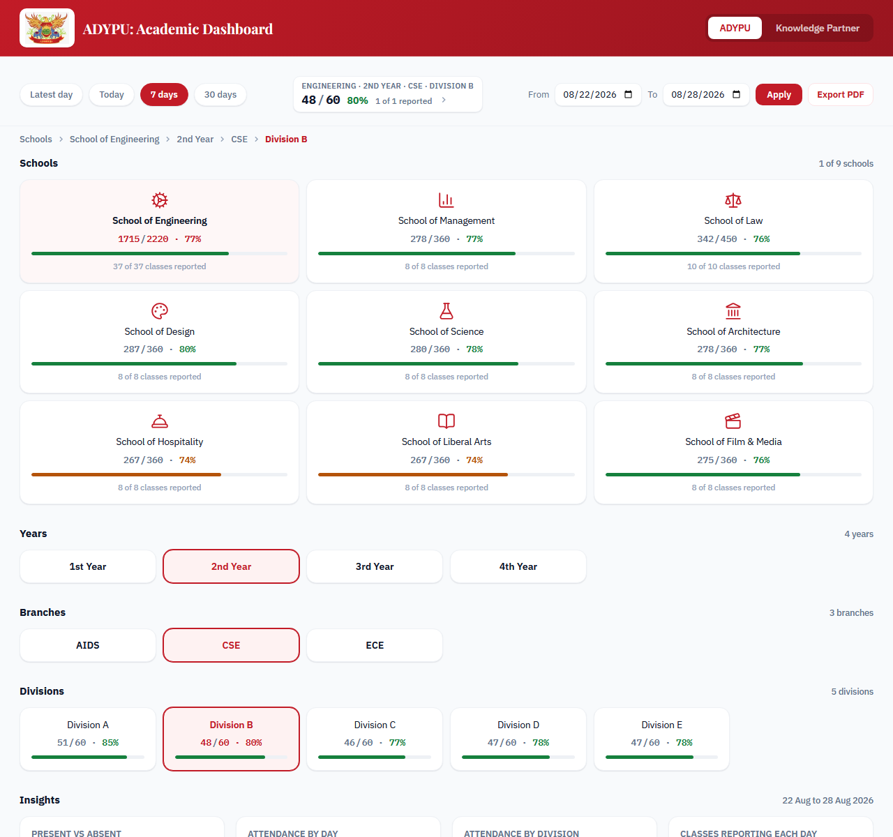
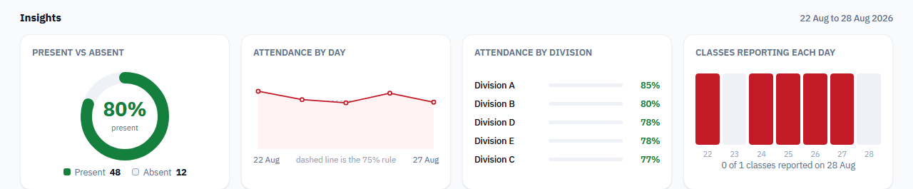

# ADYPU Academic Dashboard

Daily attendance for Ajeenkya D Y Patil University: nine schools, 136 classes,
drilled from School to Year to Branch to Division over any date range.

- Live: <https://adypu-academic-dashboard.fast-page.org/>
- Dev (faculty marking and accounts): <https://adypu-daybook.fast-page.org/>



*Figures in these screenshots are sample data.*

## What it does

- **A number that means something.** Present against the strength of the classes
  that reported, beside a count of how many of the 136 those were. Neither can
  mislead on its own.
- **Any date range.** Presets, or two date inputs. A range averages each class
  over the days it reported, so a week stays comparable to a day, and the
  breakdown names the dates behind every average.
- **Drill down and everything follows.** Pick a school, year, branch or a single
  division; the summary, breadcrumb and all four charts rescope to it.
- **Export as PDF.** The page prints itself as a dated report, named after the
  breadcrumb, showing only the school in view.
- **Faculty mark attendance from a phone.** Signed-in faculty get their class
  list with a tick box against each student, plus all-present and all-absent.
  The dashboard itself stays open to everyone: only writing needs an account.
- **Knowledge partners on their own tab.** The 11 partner institutions have
  their own tree (partner, year, program, division) at `?view=partners`. They
  never count toward a school tile, the university percentage or the classes
  reported pill.
- **Light and dark themes**, one toggle in the header of every page.



## Insights

Four charts, all hand-drawn SVG and CSS, no chart library. They rescope with the
drill-down and cover the range you picked: present against absent, attendance
per day against the university's 75% rule, a ranked comparison of whatever sits
one level below your selection, and how many classes filed a form each day. That
last one is the honesty check, since a great percentage resting on three forms
should look like exactly that.



## How the data gets here

Two ways in, merged when the page is drawn.

```
Google Form -> response Sheet -> Apps Script (tools/apps-script.gs)
                                      |  POST whole sheet as CSV,
                                      |  secret in X-Ingest-Secret
                                      v
                                 api/ingest.php
                                      |  replaces the file, every push
                                      v
                              cache/attendance.json  --+
                                                       |
Faculty phone -> login.php -> mark.php                 +--> merged on read
                                 |                     |    by index.php and
                                 |  appended, never    |    api/division.php
                                 v  seen by a push     |
                             data/submissions.php  ----+
```

Faculty either submit a present count on a Google Form, which an Apps Script
pushes to `api/ingest.php`, or tick absentees on `mark.php`, which writes its own
store. Both hold one count per class per lecture, which is what lets any date
range be rebuilt and lets one class report after each of its lectures.

They are separate files for a load-bearing reason: **`api/ingest.php` replaces
`cache/attendance.json` wholesale on every push**, so anything the app wrote into
that file would be gone within the hour. Where both name the same class, day and
lecture, the app wins, because it counted students rather than trusting a typed
total.

Two rules hold the numbers together:

- **`includes/structure.php` is canonical.** Every class that exists and its
  strength. The denominator never comes from a submitted row, so it cannot drift
  from a typo on the Form.
- **The structure leads the submissions.** A class nobody reported still exists,
  still contributes its strength, and is flagged unreported, so "nobody came"
  and "nobody submitted" never look the same.

## Faculty marking

Everything here lives on the dev site, on the `faculty-marking` branch. The
dashboard stays public; only writing attendance needs a login.

- **Sign up** at `/login.php`. A school's join code activates the account
  instantly; a wrong or missing code queues it for an admin rather than
  refusing it, so a teacher who missed the memo still ends up somewhere an admin
  can see them.
- **Mark** at `/mark.php`. Pick class, date and lecture (the URL carries all
  three, so a daily class can be bookmarked). With a student list for the class
  you get a tick box per student, where a tick means absent and the default is
  everyone present. Without one you get a single present count, so all 136
  classes work from day one and each upgrades as its school's list arrives. The
  phone never posts a present total: it is computed server side from the roster,
  and a typed count is clamped to the class strength.
- **Admin** at `/admin.php`: approve queued accounts, disable them, rotate each
  school's join code, and generate a temporary password when someone is locked
  out. There is no email on this host, so there are no reset links.
- **Account** at `/account.php`: change your own password.
- **Usage** at `/stats.php` (admins only): visitors, page views, updates
  received and classes reported, today and over 14 days, plus a per-school table
  for any day. Traffic is our own counter with a salted, one-day visitor hash,
  and footer link clicks are counted too. It also shows when the last push
  arrived and any Form options it had to drop.
- **Student lists** load with `tools/roster-import.php`, one file per school
  under `data/roster/`. Any division whose list size disagrees with
  `structure.php` is printed, which is how real enrolment figures find their way
  back into the structure.

## The two sites

| Site | Branch | Purpose |
| --- | --- | --- |
| <https://adypu-academic-dashboard.fast-page.org/> | `main` | Production: the dashboard and the Form pipeline |
| <https://adypu-daybook.fast-page.org/> | `faculty-marking` | Dev: everything above, tried out before it goes live |

Never upload a `faculty-marking` file to production: `main` has no `auth.php`,
`page.php` or `roster.php`, so a branch `index.php` there is a blank HTTP 500.
Give each site its own `includes/config.local.php` with a different
`INGEST_SECRET` and `ADMIN_HASH`.

`tools/stage-upload.sh [ref|--all]` copies exactly the files an upload needs into
`upload/`, paths intact, and never includes `config.local.php`, `data/`, `tools/`
or `tests/`. The host is InfinityFree: FTP only, no outbound HTTP from PHP
(hence the push pipeline), and a 24 hour suspension if the daily hits limit is
exceeded.

## Running it

PHP 8, no framework, no Composer, no build step. Vanilla JS, hand-drawn SVG
charts.

```
php -S localhost:8000                  # then open /index.php
php tests/test_attendance_parser.php   # parser suite, prints OK
php tests/test_marking.php             # store, merge, accounts, roster import
php tests/test_partner_divisions.php   # which partner program-years the request lists
node tests/test_marking_ui.js          # the marking screen's live count
node tests/test_theme_contrast.js      # light and dark contrast
node tests/test_charts.js              # chart scoping suite, prints OK
php tools/form-options.php             # regenerate the Form's dropdowns
php tools/data-request.php roster      # the student list request for the schools
php tools/roster-import.php eng eng.csv  # load a returned list
```

To sign in locally, put an `ADMIN_EMAIL` and an `ADMIN_HASH` in
`includes/config.local.php` (see `config.local.example.php`); everyone else signs
up at `/login.php` and is approved from `/admin.php`, or activates themselves
with their school's join code.

With no `cache/attendance.json` and no `data/`, the dashboard serves sample rows,
so a fresh checkout is usable straight away. `tests/` is assert-based scripts, no
framework; add a case for any parser, merge or chart-scoping change. Every bug
here so far has been a row silently not counting, which is exactly what a test
catches and eyeballing does not.

## Layout

```
index.php                dashboard, open to everyone
login.php                faculty sign in and sign up
mark.php                 tick the class list, or type a count
admin.php                approve accounts, rotate join codes, reset passwords
account.php              change your own password
stats.php                usage page, admins only
api/ingest.php           receives the pushed sheet
api/click.php            counts footer link clicks
api/division.php         division breakdown for the modal
includes/attendance.php  parsing, the day map, the merge, ranges, totals
includes/structure.php   the canonical class list
includes/auth.php        accounts, sessions, join codes
includes/store.php       reads and writes everything under data/
includes/roster.php      student lists, one file per school
includes/traffic.php     visitor and click counters behind the usage page
includes/page.php        shared header, footer and account menu
js/dashboard.js          drill-down, range controls, modal
js/charts.js             the four charts
js/mark.js               live count, all present/absent, offline draft
js/theme.js              light/dark toggle shared by every page
tools/apps-script.gs     goes in the Apps Script editor
tools/roster-import.php  a returned student list -> data/roster/<school>.php
tools/data-request.php   builds the workbooks sent to schools and partners
tools/stage-upload.sh    stages the files an upload needs
```

`data/` is never in git and never uploaded: it holds the accounts, the student
names and everything the live site wrote for itself. Every file in it is JSON
behind a `<?php exit; ?>` line, so asking the web server for one returns a blank
page rather than a roster.
